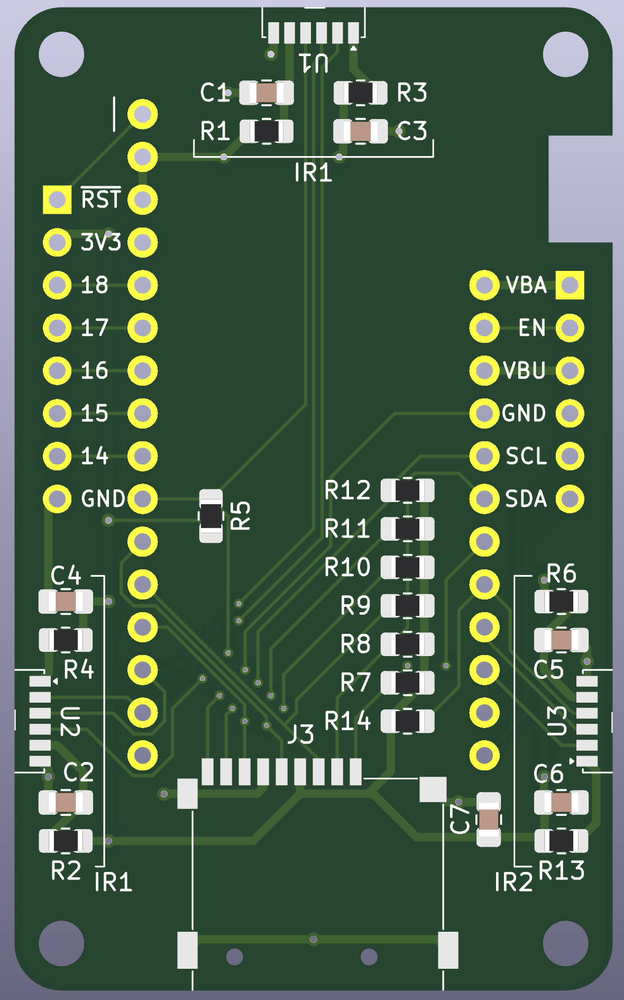
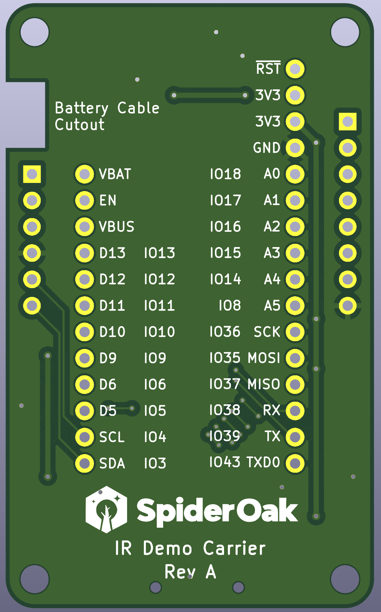

# IR Demo FeatherWing

This is a carrier board for an Adafruit Feather device, designed specifically
for the ESP32-S3 Feather. It breaks out two UARTs into IR transceivers, and SPI
to a microSD slot.

## Board View

<a href="images/front.png"></a>
<a href="images/back.png"></a>

## Assembly Options

There are three sets of components for the IR transceivers, but only two
can be used. The sections marked IR1 are shared, connected to UART1, and
only one section needs to be populated. The section marked IR2 is
connected to UART2.

Technically, the only components that have to be installed are one
transceiver and two links to power them (across R1/R3 on the top, R2/R4
on the left, and R6/R13 on the right). The capacitors improve stability
but aren't strictly required. The other resistors are pull-ups for the
SD lines (recommended but makes little practical difference) and
pull-ups for the IR shutdown (only really necessary if you plan on
shutting down the CPU)

## IR Transceivers

IR1 is connected to UART1 on the standard Feather TX/RX pins, which are
on GPIOs 39 and 38, respectively. IR2 is connected to UART2 on GPIOs 5
and 6. Each transceiver has an active low enable pin that is by default
pulled high. These are on GPIOs 8 and 9 for IR1 and IR2.

Enabling IrDA mode requires setting `UART_IRDA_EN` in `UART_CONF0_REG`.
Additionally, to transmit, you need to set `UART_IRDA_TX_EN`. By
default, IrDA mode is half duplex, and `UART_IRDA_TX_EN` needs to be
toggled to switch between transmit and receive modes. To enable both
transmit and receive at the same time, which will echo all transmitted
data through the RX line, set `UART_IRDA_DPLX`.

For reasons I don't understand, the only thing that can be set via IDF
APIs is enabling IrDA mode. All of the other IrDA settings are not
available via IDF APIs, so you will likely have to twiddle the registers
directly. In C, this can be done by including `soc/uart_struct.h` and
using the bitfield structs provided. i.e.

```
UART1.conf0.irda_dplx = 1;
```

### Pin Summary (IR1 on UART1)

| GPIO Pin | Function |
|----------|----------|
| 39 | Transmit |
| 38 | Receive |
| 8 | Enable (active low) |

### Pin Summary (IR2 on UART2)

| GPIO Pin | Function |
|----------|----------|
| 5 | Transmit |
| 6 | Receive |
| 9 | Enable (active low) |

## Micro SD

The SD card is connected to SPI such that it should be usable directly
through the IOMUX on IOs 35, 36, and 37. CS is connected to GPIO 11.
Card detect is connected to GPIO 13.

Additionally, DAT1 and DAT2 (only used in SD mode) are connected to
GPIOs 12 and 10, respectively, so you should theoretically be able to
enable 4-bit SD through the SD/MMC controller.

### Pin Summary (SPI mode)

| GPIO Pin | Function |
|----------|----------|
| 36 | SCK |
| 35 | MOSI |
| 37 | MISO |
| 11 | CS |

### Pin Summary (SD 1-bit mode)

| GPIO Pin | Function |
|----------|----------|
| 36 | CLK |
| 35 | CMD |
| 37 | DAT0 |
| 11 | CD |

### Pin Summary (SD 4-bit mode)

| GPIO Pin | Function |
|----------|----------|
| 36 | CLK |
| 35 | CMD |
| 37 | DAT0 |
| 12 | DAT1 |
| 10 | DAT2 |
| 11 | DAT3 |

## Headers

 GPIOs 14-18 are unused and are broken out for futher expansion. The I2C
 lines are also available, as well as VBATT, VBUS, 3V3, GND, EN, and
 ~RST.